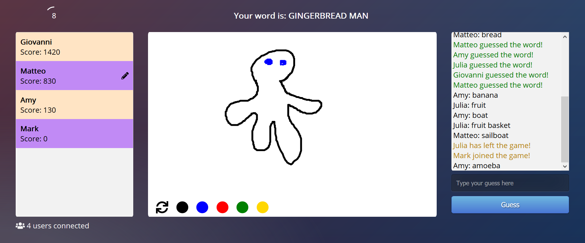

# Angular Sketch



Angular Sketch is an online multiplayer game inspired by the popular party game Pictionary. Players take turns drawing pictures based on random prompts, and other players try to guess what the drawing is; the fastest correct guesses get the most points. By making use of the [Websocket protocol](https://en.wikipedia.org/wiki/WebSocket), this app features a real-time shared drawing canvas and a chat box for guessing the drawing and other communication.

The game is currently playable at: [https://angular-pictionary.netlify.com/](https://angular-pictionary.netlify.com/)

## Getting Started
To run the client, simply clone this repository and then run:

```
npm i
ng serve
```

To run the server locally as well, head to [the server repository](https://github.com/giovannistasi/angular-sketch-server) and change the respective addresses to localhost.

## Built With

* [Angular](https://angular.io/) for the frontend
* [Socket.io](https://socket.io/) for Websocket management
* [Express](https://expressjs.com/) for the backend

## License

This project is licensed under the MIT License - see the [LICENSE.md](LICENSE.md) file for details

